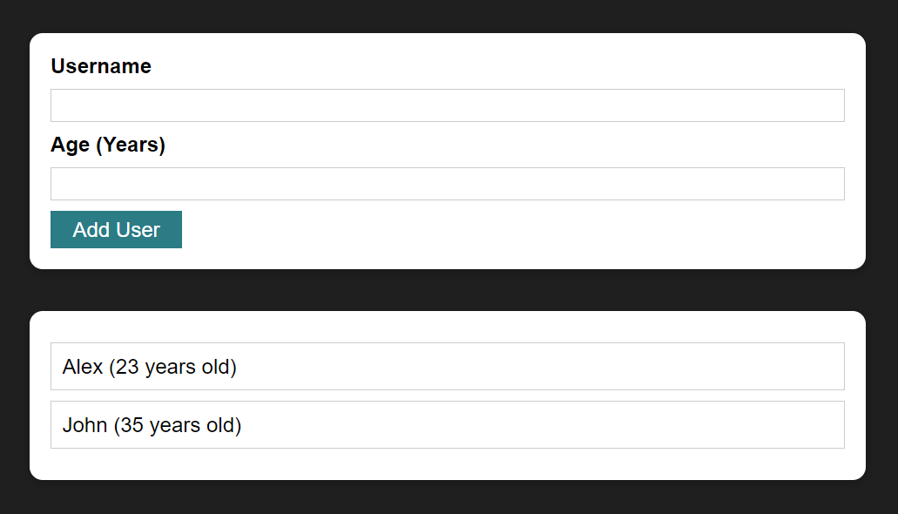

# todo-app-react
Simple todo app where you can add user data and display data in list.

<h1>[Getting Started]</h1>
    <h3>Execution</h3>
    
If you want to run our project in your local machine

    
Follow the given steps:

    <ul>
        <li>Clone our respository <a href="https://github.com/Suhani1102/todo-app-react">https://github.com/Suhani1102/todo-app-react</a></li>
        <li>Open our code in VS code</li>
        <li>On your terminal just write the command npm install</li>
        <li>Start the server by writing 'npm start' on Terminal</li>
        <li>Than you can navigate to our website.</li>
    </ul>
        <h1>Built with</h1>
    <ul>
        <li>React.JS</li>
    </ul>
